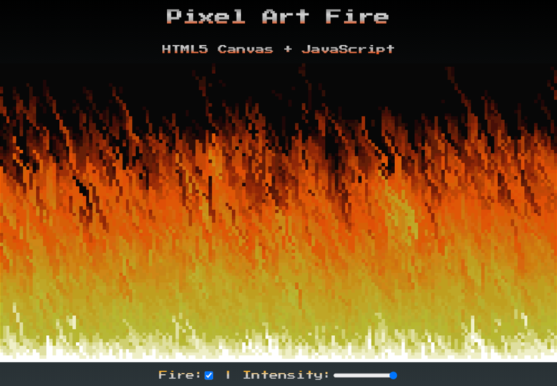

# Pixel Art Fire

Realistic pixel art fire effect using HTML5 Canvas + JavaScript.

🖱 Click on the picture above to see the project running!

---

#### 📑 References

- [JavaScript Modules](https://developer.mozilla.org/en-US/docs/Web/JavaScript/Guide/Modules)
- [HTML5 Canvas - 2D Context](https://developer.mozilla.org/pt-BR/docs/Web/API/CanvasRenderingContext2D)  
- [Doom Fire Algorithm - GitHub Filipe Deschamps](https://github.com/filipedeschamps/doom-fire-algorithm)
